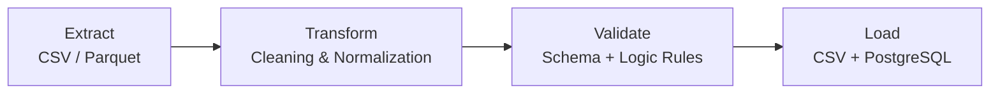
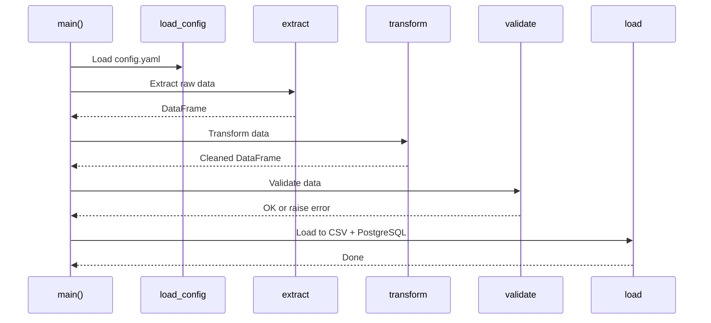

# **NYC Taxi ETL Pipeline**

This project processes NYC Yellow Taxi trip data and exposes the cleaned results through a small full‑stack system.  
It includes a Python ETL pipeline, a PostgreSQL database, a FastAPI backend, and a React dashboard.

The goal is to show a clear end‑to‑end flow:  
**raw data → cleaned data → database → API → UI**

---

# **Project Structure**

```
nyc-taxi-etl-pipeline/
├── pipeline/               # Python ETL logic
├── data/                   # Raw input files
├── output/                 # Cleaned output files
├── docker-compose.yml      # PostgreSQL service
│
├── backend/                # FastAPI backend (Python + SQLAlchemy)
│   ├── main.py
│   ├── models.py
│   └── db.py
│
├── frontend/               # React + Vite + Tailwind dashboard
│   └── src/components/Dashboard.tsx
│
└── Makefile                # Unified commands
```

---

# **Setup**

## 1. Create and activate a virtual environment

```bash
python3 -m venv venv
source venv/bin/activate
```

## 2. Install all dependencies

```bash
make setup
```

This installs Python packages and frontend dependencies.

## 3. Start PostgreSQL

```bash
make db-up
```

This starts a PostgreSQL 15 container with a `taxi` database.

---

# **Run the ETL Pipeline**

```bash
make pipeline
```

The pipeline performs four steps:

1. Extract data from CSV or Parquet  
2. Transform it using rules defined in `config.yaml`  
3. Validate schema and logical constraints  
4. Load cleaned data into:
   - `output/cleaned_output.csv`
   - the `yellowcab_cleaned` table in PostgreSQL

---

## ETL Architecture & Pipeline Design

The NYC Taxi ETL pipeline follows a clean, deterministic multi‑stage flow.  
Each stage is implemented as a separate module to keep the system testable and maintainable.

### ETL Pipeline Overview



### Python Orchestration (`main()`)

The pipeline is orchestrated by a simple, readable controller:

```python
def main():
    setup_logging()
    config = load_config("config.yaml")

    df = extract(config["input_path"])
    df = transform(df, config)
    validate(df, config)
    load(df, config["output_path"], config.get("database"))
```

Each step is isolated:

- **extract()** → reads raw CSV/Parquet into a DataFrame  
- **transform()** → applies cleaning rules from `config.yaml`  
- **validate()** → enforces schema, ranges, and logical constraints  
- **load()** → writes cleaned data to:
  - `output/cleaned_output.csv`
  - PostgreSQL (`yellowcab_cleaned` table)

### Module Responsibilities

| Module | Responsibility |
|--------|----------------|
| `pipeline.extract` | Reads raw taxi data from disk |
| `pipeline.transform` | Cleans, normalizes, and enriches the dataset |
| `pipeline.validate` | Ensures schema correctness and logical consistency |
| `pipeline.load` | Writes cleaned data to CSV and PostgreSQL |
| `pipeline.config` | Loads YAML configuration |
| `pipeline.logging_config` | Centralized logging setup |

### Sequence Diagram



### Design Principles

- **Deterministic** — same input → same output  
- **Config‑driven** — transformation rules live in `config.yaml`  
- **Composable** — each stage is a pure function  
- **Testable** — every module has isolated unit tests  
- **Extensible** — new data sources or sinks can be added without touching the pipeline core  

---

# **Backend API (FastAPI)**

The backend is a lightweight FastAPI service using SQLAlchemy to query PostgreSQL.

Start the backend:

```bash
make dev-api
```

The server runs on:

```
http://localhost:3001
```

Example endpoint:

```
GET /api/stats
```

Returns basic statistics from the `yellowcab_cleaned` table.

---

# **Frontend Dashboard**

The frontend is a React application styled with Tailwind.  
It displays summary metrics and can be extended with charts and maps.

**Note:** The frontend uses **React 18** because **Recharts is not yet compatible with React 19**.

Start the frontend:

```bash
make dev-ui
```

The dashboard runs on:

```
http://localhost:5173
```

---

# **Run Backend and Frontend Together**

```bash
make dev
```

This starts both services in parallel.

---

# **Verify Data in PostgreSQL**

```bash
docker exec -it taxi_postgres psql -U postgres -d taxi
SELECT COUNT(*) FROM yellowcab_cleaned;
```

---

# **Clean Up**

```bash
make clean
```

Stops Docker and removes build artifacts.
